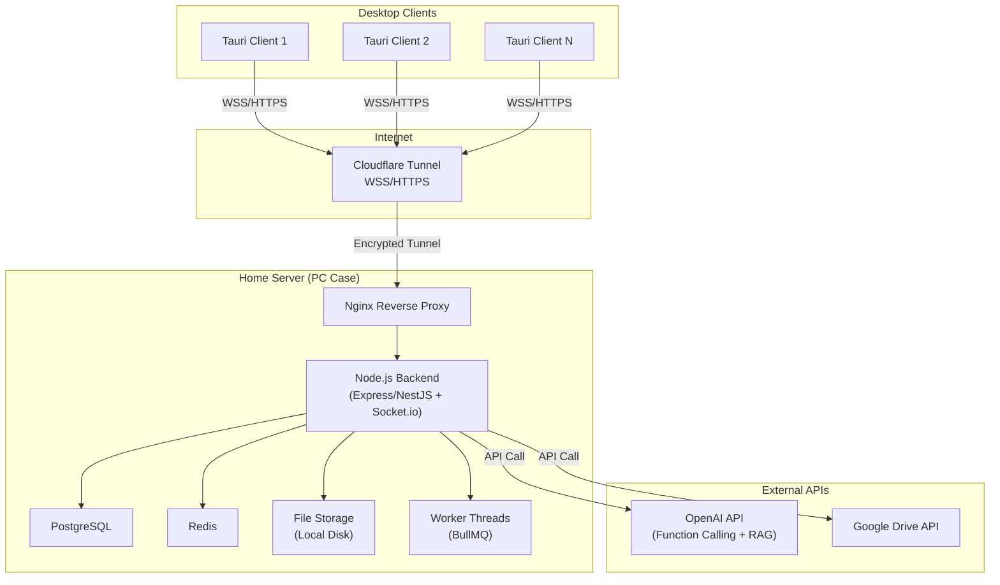
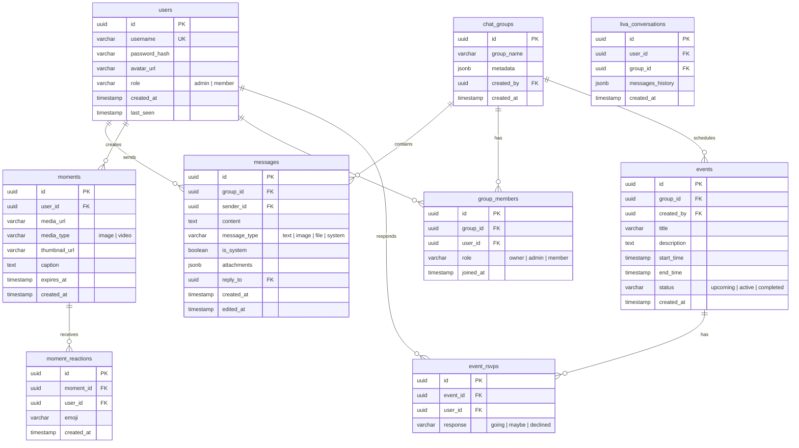
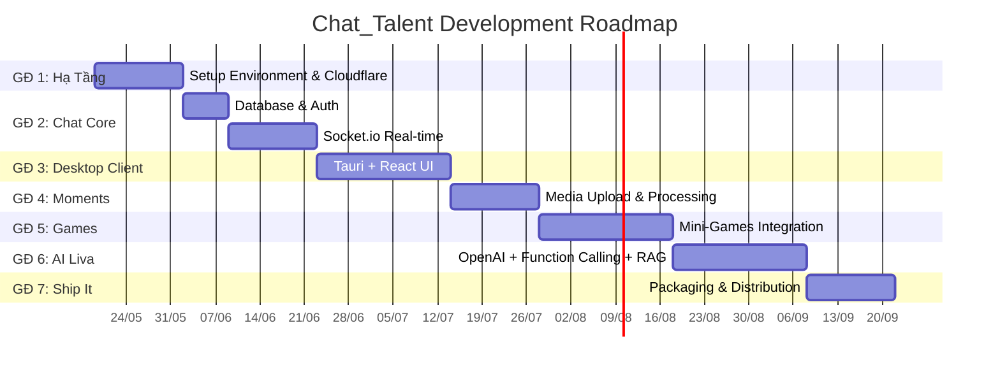

# 🚀 Kế Hoạch Triển Khai: Chat_Talent — Ứng Dụng Desktop Chat Self-Hosted Tích Hợp AI

> **Mục tiêu**: Xây dựng phần mềm desktop cho nhóm bạn bè, hỗ trợ chat real-time, chia sẻ khoảnh khắc, mini-games, và trợ lý AI "Liva" — tất cả chạy trên máy case cá nhân tại nhà.

---

## Tổng Quan Kiến Trúc



---

## Cấu Trúc Thư Mục Dự Án

```
d:\Chat_Talent\
├── server/                    # Backend Node.js
│   ├── src/
│   │   ├── config/            # DB, Redis, Cloudflare config
│   │   ├── modules/
│   │   │   ├── auth/          # JWT authentication
│   │   │   ├── users/         # User management
│   │   │   ├── chat/          # Messages, groups, Socket.io
│   │   │   ├── moments/       # Media upload (chunked)
│   │   │   ├── events/        # Calendar events
│   │   │   ├── games/         # Game state server
│   │   │   └── liva/          # AI assistant (OpenAI + RAG)
│   │   ├── middleware/        # RBAC, rate limiting, validation
│   │   ├── workers/           # BullMQ background jobs
│   │   └── utils/
│   ├── prisma/                # Database schema & migrations
│   ├── nginx/                 # Nginx config for static assets
│   ├── package.json
│   └── tsconfig.json
│
├── client/                    # Tauri + React Frontend
│   ├── src/                   # React app
│   │   ├── components/
│   │   │   ├── Chat/
│   │   │   ├── Moments/
│   │   │   ├── Events/
│   │   │   ├── Games/
│   │   │   ├── Liva/
│   │   │   └── Shared/
│   │   ├── hooks/             # Custom React hooks
│   │   ├── stores/            # Zustand state management
│   │   ├── services/          # API & Socket.io clients
│   │   ├── styles/            # CSS design system
│   │   └── utils/
│   ├── src-tauri/             # Rust backend (Tauri core)
│   │   ├── src/
│   │   ├── Cargo.toml
│   │   └── tauri.conf.json
│   ├── package.json
│   └── vite.config.ts
│
├── games/                     # HTML5 mini-games (standalone)
│   ├── chess/
│   ├── snake/
│   └── 2048/
│
├── docs/                      # Documentation
│   ├── setup-guide.md
│   ├── user-manual.md
│   └── webview2-notice.txt
│
└── scripts/                   # Build & deploy scripts
    ├── build-client.ps1
    ├── setup-server.ps1
    └── package-release.ps1
```

---

## Lược Đồ Cơ Sở Dữ Liệu (PostgreSQL)



---

## Technology Stack Tổng Hợp

| Layer | Công nghệ | Lý do lựa chọn |
|-------|-----------|-----------------|
| **Backend Runtime** | Node.js 22 LTS + TypeScript | Event-driven I/O, xử lý ngàn kết nối WebSocket đồng thời, dùng chung JS với frontend |
| **Backend Framework** | Express.js + Socket.io | Nhẹ, linh hoạt, hệ sinh thái middleware phong phú |
| **Database** | PostgreSQL 16 + Prisma ORM | ACID, JSONB cho metadata linh hoạt, backup đơn giản |
| **Cache/Pub-Sub** | Redis 7 | Trạng thái online, typing indicator, pub/sub fan-out cho Socket.io |
| **Desktop Client** | Tauri 2.x + React 19 + Vite | Portable .exe ~5-10MB, RAM ~30MB, khởi động <200ms |
| **UI Styling** | Vanilla CSS + CSS Variables | Tối ưu bundle size, dark mode native |
| **State Management** | Zustand | Nhẹ, TypeScript-friendly, không boilerplate |
| **AI Assistant** | OpenAI API (GPT-4o) + Function Calling | Structured outputs, parallel function calling, RAG |
| **Networking** | Cloudflare Tunnel | Vượt CGNAT, SSL tự động, ẩn IP, DDoS protection miễn phí |
| **Reverse Proxy** | Nginx | Phục vụ static assets, streaming media |
| **Task Queue** | BullMQ | Xử lý nền: thumbnail, video compression |
| **Mini-Games** | Phaser 3 / Canvas API | HTML5 games nhúng qua iframe, multiplayer qua Socket.io |

---

## Giai Đoạn 1: Hạ Tầng & Nền Tảng (Tuần 1-2)

### Mục tiêu
Máy chủ tại nhà sẵn sàng kết nối từ internet, project scaffold hoàn chỉnh.

### Công việc chi tiết

**1.1 Khởi tạo Project Structure**
- Tạo monorepo với `server/` và `client/` directories
- Cấu hình TypeScript, ESLint, Prettier cho cả 2 packages
- Setup `.env` management với `dotenv`

**1.2 Setup Server Environment**
```
- Node.js 22 LTS
- PostgreSQL 16 (local install hoặc Docker)
- Redis 7 (local install hoặc Docker)
- Nginx (cho static file serving)
```

**1.3 Cloudflare Tunnel Configuration**
1. Đăng ký domain → chuyển nameserver về Cloudflare
2. Cài `cloudflared` trên máy case
3. `cloudflared tunnel login` → lấy cert.pem
4. `cloudflared tunnel create chat-talent` → lấy Tunnel UUID
5. Tạo `config.yml`:
```yaml
tunnel: <TUNNEL-UUID>
credentials-file: /path/to/<TUNNEL-UUID>.json
ingress:
  - hostname: chat.yourdomain.com
    service: http://localhost:3000
  - hostname: assets.yourdomain.com
    service: http://localhost:8080  # Nginx static
  - service: http_status:404
```
6. Tạo DNS CNAME record trỏ về tunnel
7. Setup `cloudflared` chạy như Windows Service

**1.4 Backend Scaffold**
- Express.js app với TypeScript
- Prisma ORM setup kết nối PostgreSQL
- Redis client setup (ioredis)
- Health check endpoint `/api/health`
- Cấu hình CORS cho domain Cloudflare

### Deliverable
✅ Truy cập `https://chat.yourdomain.com/api/health` từ internet → trả về `{ status: "ok" }`

---

## Giai Đoạn 2: Lõi Chat Real-time (Tuần 3-5)

### Mục tiêu
Hệ thống chat nhóm hoạt động đầy đủ với xác thực JWT.

### Công việc chi tiết

**2.1 Database Schema & Migrations**
- Prisma schema cho: `users`, `chat_groups`, `group_members`, `messages`
- Seed data cho development
- UUID primary keys toàn bộ

**2.2 Authentication Module**
- `POST /api/auth/register` — đăng ký (bcrypt hash password)
- `POST /api/auth/login` — đăng nhập → JWT (access + refresh token)
- JWT middleware bảo vệ tất cả routes
- Refresh token rotation

**2.3 User & Group APIs**
- CRUD users (profile, avatar upload)
- CRUD chat groups
- Group membership management (join/leave/invite)

**2.4 Real-time Messaging (Socket.io)**
```
Namespace: /chat
Events:
  - join_group(groupId)      → Join Socket.io room
  - send_message(data)       → Broadcast to room + save to DB
  - edit_message(data)       → Update + broadcast
  - delete_message(id)       → Soft delete + broadcast
  - typing_start(groupId)    → Broadcast via Redis pub/sub
  - typing_stop(groupId)     → Clear typing indicator
  - message_read(messageId)  → Update read receipts
```

**2.5 Redis Integration**
- `@socket.io/redis-adapter` cho horizontal scaling
- Online/offline status tracking (Redis SET)
- Typing indicators (Redis key with TTL 3s)
- Unread message counts (Redis HASH per user)

**2.6 Message Features**
- Phân trang: cursor-based pagination (không dùng offset)
- Reply threads (reply_to foreign key)
- Emoji reactions (JSONB trên message)
- Tìm kiếm tin nhắn (PostgreSQL full-text search)

### Deliverable
✅ 2 clients kết nối qua internet, chat real-time, thấy typing indicator, online status

---

## Giai Đoạn 3: Tauri Desktop Client (Tuần 6-8)

### Mục tiêu
Ứng dụng desktop portable chạy trên Windows, UI hoàn chỉnh.

**3.1 Project Setup**
- `npm create tauri-app` với React + Vite + TypeScript
- Cấu hình `tauri.conf.json`: window size, title, icon
- Setup Zustand stores cho state management

**3.2 UI Design System (Vanilla CSS)**
- CSS Custom Properties cho theming (dark/light mode)
- Color palette: dark gradient theme (#0f0f23 → #1a1a2e → #16213e)
- Accent colors: teal/cyan (#00d2ff), warm coral (#ff6b6b)
- Typography: Inter font (Google Fonts embedded)
- Micro-animations: message slide-in, hover effects, transition 200ms
- Glassmorphism panels (backdrop-filter: blur)

**3.3 Core Components**
| Component | Mô tả |
|-----------|--------|
| `Sidebar` | Danh sách groups, online users, navigation |
| `ChatPanel` | Message list, input, typing indicator |
| `MessageBubble` | Single message with avatar, time, reactions |
| `UserProfile` | Profile card, avatar, status |
| `GroupSettings` | Group info, members list, settings |
| `NotificationBadge` | Unread count badges |

**3.4 Socket.io Client Integration**
- Auto-reconnect với exponential backoff
- Optimistic UI updates (gửi tin nhắn → hiển thị ngay → confirm từ server)
- Message queue offline (lưu pending messages khi mất kết nối)

**3.5 Build Portable .exe**
- `tauri build` → tạo standalone .exe (~5-10MB)
- KHÔNG dùng MSI/NSIS installer
- Package vào .zip kèm `README.txt` + `webview2-check.bat`

> ⚠️ **WebView2 Dependency**: Windows 10 có thể thiếu WebView2 Runtime. Tạo script `webview2-check.bat` kiểm tra và hướng dẫn tải nếu thiếu.

### Deliverable
✅ File `.zip` < 15MB, giải nén, chạy `.exe` → kết nối server, chat real-time

---

## Giai Đoạn 4: Moments & Media Upload (Tuần 9-10)

### Mục tiêu
Tải lên/xem ảnh, video dung lượng lớn mà không crash server.

**4.1 Chunked Upload API (Server)**
```
POST /api/upload/init     → Tạo upload session, trả fileId
POST /api/upload/chunk    → Nhận chunk (5MB), ghi stream xuống disk
POST /api/upload/complete → Merge chunks → file hoàn chỉnh
DELETE /api/upload/abort  → Cleanup chunks nếu cancel
```
- `fs.createWriteStream()` — KHÔNG buffer vào RAM
- Thư mục tạm: `uploads/temp/{fileId}/`
- Thư mục chính: `uploads/moments/`, `uploads/avatars/`

**4.2 Background Processing (BullMQ Workers)**
- Image: resize, generate thumbnail (sharp library)
- Video: compress, extract thumbnail frame (ffmpeg)
- Worker threads chạy độc lập, KHÔNG block Event Loop

**4.3 Static File Serving (Nginx)**
```nginx
server {
    listen 8080;
    location /media/ {
        alias /path/to/uploads/;
        expires 7d;
        add_header Cache-Control "public, immutable";
    }
}
```

**4.4 Moments UI (Client)**
- Feed dạng grid/masonry layout
- Upload drag & drop với progress bar
- Video player inline
- Caption, reactions (emoji)
- Auto-expire (tùy chọn 24h/7d/permanent)

### Deliverable
✅ Upload video 500MB thành công, server RAM ổn định < 200MB

---

## Giai Đoạn 5: Mini-Games (Tuần 11-13)

### Mục tiêu
2-3 mini-games multiplayer chơi được trong app.

**5.1 Game Selection**
| Game | Loại | Multiplayer |
|------|------|-------------|
| Cờ Caro (Gomoku) | Turn-based strategy | 2 players |
| Snake Arena | Real-time action | 2-4 players |
| 2048 Race | Puzzle competition | Solo + leaderboard |

**5.2 Architecture**
```
Socket.io Namespace: /games
Rooms: /games/{gameType}/{roomId}

Server-Authoritative model:
  Client → input events (move, direction)
  Server → validate → update state → broadcast state
  Client → render received state + interpolation
```

**5.3 Server Game Engine**
- Tick rate: 15 updates/second (cho Snake), turn-based cho Caro
- Game state lưu trên Redis (in-memory, tự expire)
- Anti-cheat: server validate mọi move
- Matchmaking: simple lobby system trong chat group

**5.4 Client Integration**
- Games render trong `<iframe sandbox>` hoặc `<webview>`
- Communication qua `postMessage` API
- Game panel mở bên cạnh chat (split view)

### Deliverable
✅ 2 người chơi Caro real-time qua internet, kết quả hiển thị trong chat

---

## Giai Đoạn 6: Trợ Lý AI Liva (Tuần 14-16)

### Mục tiêu
AI assistant quản lý nhóm với Function Calling + RAG.

**6.1 OpenAI Integration**
- System prompt định nghĩa persona "Liva" (thân thiện, hữu ích, tiếng Việt)
- Model: `gpt-4o` hoặc `gpt-4o-mini` (tiết kiệm)
- Conversation history lưu PostgreSQL (`liva_conversations`)

**6.2 Function Calling Tools**
```
Tools được định nghĩa:
- create_event(title, start_time, end_time, group_id)
- list_upcoming_events(group_id, limit)
- summarize_messages(group_id, since_timestamp)
- get_group_stats(group_id)  // số tin nhắn, active users
- search_messages(group_id, query)
- get_user_info(username)
- create_poll(question, options[], group_id)
```
- `strict: true` trên tất cả function schemas
- Parallel Function Calling cho multi-intent commands

**6.3 RBAC Security Layer**
```
Permission matrix:
  admin  → full access (tất cả tools)
  member → read-only tools + create_event + create_poll

Flow:
  User message → Extract user role from JWT
  → Send to OpenAI with available tools (filtered by role)
  → Receive function calls → Server-side permission check
  → Execute if authorized → Return tool_outputs to OpenAI
  → AI generates friendly response → Send to chat
```

> 🚨 **Prompt Injection Protection**: Server PHẢI validate permissions TRƯỚC khi execute function calls. Không bao giờ trust output từ AI model trực tiếp.

**6.4 RAG Pipeline (Google Drive)**
1. Detect Google Drive links trong chat (regex)
2. Google Drive API → download/extract text content
3. Text chunking (500 tokens per chunk, 100 overlap)
4. Embedding: OpenAI `text-embedding-3-small`
5. Vector storage: local file-based (simple cosine similarity) hoặc SQLite với `sqlite-vss`
6. Query: user hỏi → embed query → top-K similar chunks → inject vào context → Liva trả lời với citations

**6.5 Liva UI (Client)**
- Liva avatar + message bubble khác biệt (gradient border, AI icon)
- `/liva` command prefix hoặc @mention
- Streaming response (SSE/chunked) cho UX mượt
- Tool execution indicators (loading animation)

### Deliverable
✅ "Liva, tạo sự kiện họp tối mai 8h" → event được tạo trong DB → thông báo trong chat

---

## Giai Đoạn 7: Đóng Gói & Phân Phối (Tuần 17-18)

### Mục tiêu
Sản phẩm sẵn sàng cho người dùng cuối.

**7.1 Server Hardening**
- Memory leak detection (clinic.js, heapdump)
- Graceful shutdown handling
- Auto-restart với PM2
- Database backup script (pg_dump cron job)
- Rate limiting trên tất cả API endpoints

**7.2 Client Packaging**
```
ChatTalent-v1.0.zip (< 15MB)
├── ChatTalent.exe
├── README.txt          # Hướng dẫn sử dụng
├── webview2-check.bat  # Kiểm tra WebView2
└── config.json         # Server URL, app settings
```

**7.3 Documentation**
- `setup-guide.md`: Hướng dẫn cài đặt server (cho admin)
- `user-manual.md`: Hướng dẫn sử dụng cho bạn bè
- `webview2-notice.txt`: Hướng dẫn cài WebView2 nếu thiếu

**7.4 Distribution**
- Upload `.zip` lên Google Drive
- Chia sẻ link cho nhóm bạn
- Server chạy 24/7 trên máy case (PM2 + cloudflared as service)

### Deliverable
✅ Bạn bè tải .zip từ Google Drive → giải nén → chạy → chat ngay lập tức

---

## Verification Plan

### Automated Tests
- Unit tests: Jest cho business logic (auth, message, game state)
- Integration tests: Supertest cho API endpoints
- Socket.io tests: socket.io-client mock
- `npm run test` pass 100%

### Manual Verification
- [ ] 3+ clients chat đồng thời qua Cloudflare Tunnel
- [ ] Upload file 500MB+ không crash server
- [ ] Chơi game multiplayer real-time (latency < 200ms)
- [ ] Liva thực hiện function calling chính xác
- [ ] Portable .exe chạy trên Windows 10/11 sạch
- [ ] .zip file < 15MB trên Google Drive

---

## Open Questions — Cần Xác Nhận

### 1. Tên miền
Bạn đã có tên miền chưa? Nếu chưa, gợi ý dùng domain `.com` hoặc `.xyz` (giá rẻ ~$1/năm) và đăng ký qua Cloudflare Registrar.

### 2. Số lượng người dùng dự kiến
Nhóm bạn khoảng bao nhiêu người? Điều này ảnh hưởng đến cấu hình PostgreSQL connections, Redis memory, và Socket.io rooms.

### 3. OpenAI API Key
Bạn đã có OpenAI API key chưa? Chi phí ước tính:
- `gpt-4o-mini`: ~$0.15/1M input tokens — rất rẻ cho nhóm nhỏ
- `gpt-4o`: ~$2.50/1M input tokens — mạnh hơn nhưng đắt hơn

### 4. Máy case specs
CPU, RAM, SSD của máy chủ tại nhà là bao nhiêu? Tối thiểu khuyến nghị:
- CPU: 4 cores
- RAM: 8GB (Node.js ~200MB + PostgreSQL ~500MB + Redis ~100MB)
- SSD: 50GB+ trống cho media storage

### 5. Framework preference
- **Backend**: Express.js (đơn giản, linh hoạt) hay NestJS (structured, enterprise-grade)?
- **Frontend**: React (phổ biến nhất) hay Vue/Svelte (nhẹ hơn)?

### 6. Ngôn ngữ giao diện
UI chủ yếu tiếng Việt hay tiếng Anh? Hay cần hỗ trợ i18n (đa ngôn ngữ)?

---

## Timeline Tổng Quan



**Tổng thời gian: ~18 tuần (4.5 tháng)**
